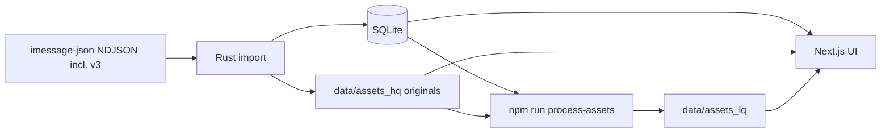

# message-vault-rs

Import iMessage exports into SQLite and browse them in a local web UI — with original attachments preserved and optional low-def derivatives for fast viewing.

## Features

- **Import from [imessage-json](https://github.com/bitrealm-dev/imessage-json) NDJSON** (including schema v3) into a single SQLite database
- **Replace or append** imports via a staging area (dedupe by message `guid`; no run/version concept)
- **Content-addressed originals** in `data/assets_hq` (SHA-256; never overwritten by processing)
- **Low-quality media** via `@napi-rs/image` + ffmpeg into `data/assets_lq` (pick at render time)
- **Contacts + blacklist** from CSV; optional VCF → CSV helper for migrating from message-vault
- **Next.js browse UI** for conversations, contacts, and tags

## Prerequisites

| Tool | Used for |
| --- | --- |
| [Rust](https://rustup.rs/) (stable) | `import`, `vcf-to-contacts` |
| Node.js 20+ | Web UI + `process-assets` |
| [ffmpeg](https://ffmpeg.org/) (+ HEIF/libheif on Linux for HEIC) | Video/audio derived media; Linux HEIC decode |

Export your messages with [imessage-json](https://github.com/bitrealm-dev/imessage-json) (`-f json`) and point `paths.export_dir` at that folder. We accept imessage-json NDJSON including schema v3, but ignore fields the vault does not use.

## Installation

```bash
git clone https://github.com/bitrealm-dev/message-vault-rs.git
cd message-vault-rs

# Rust CLI
cargo build --release

# Web + process-assets
cd web && npm ci && cd ..
```

Edit [`config/config.toml`](config/config.toml) for owner info and paths (`export_dir`, `db`, `assets_hq`, `assets_lq`, contacts/blacklist CSVs).

## Quick start

```bash
# 1. Import originals into SQLite + data/assets_hq
cargo run --release -- import --mode replace

# 2. Generate low-quality copies (optional, after import)
cd web && npm run process-assets && cd ..

# 3. Browse
cd web && npm run dev
```

Open [http://localhost:3000](http://localhost:3000).

Expected import summary (counts vary):

```
Imported into data/imessage.db
  mode:          replace
  files:         …
  conversations: …
  messages:      …
  assets copied: …
```

## Usage

### Import

```bash
cargo run --release -- import --mode replace   # wipe message tables, reload via staging
cargo run --release -- import --mode append    # merge; skip guids already in production
```

| Flag | Description | Default |
| --- | --- | --- |
| `--mode` | `replace` or `append` | `replace` |
| `--config` | Path to `config.toml` | `config/config.toml` |
| `--export-dir` | NDJSON export directory | from config |
| `--db` | SQLite database path | from config |
| `--assets-hq` | High-quality (original) asset store | from config |
| `--contacts-csv` | Contacts CSV | from config |
| `--blacklist-csv` | Blacklist CSV | from config |
| `--overwrite-contacts` | Reload contacts even if table is non-empty | off |

Flow: NDJSON → **staging** tables → promote to production → clear staging. Contacts are skipped if already loaded unless `--overwrite-contacts`.

### Process assets (low-quality media)

Run **after** import. Originals in `data/assets_hq` are never deleted or replaced.

```bash
cd web
npm run process-assets
npm run process-assets -- --force          # rebuild LQ even if present
npm run process-assets -- --dry-run
npm run process-assets -- --skip-video     # images only
```

| Flag | Description |
| --- | --- |
| `--force` | Regenerate LQ blobs |
| `--dry-run` | Log work without writing |
| `--skip-image` / `--skip-video` / `--skip-audio` | Skip a media kind |
| `--db` / `--assets-hq` / `--assets-lq` | Override config paths |

Images use [@napi-rs/image](https://image.napi.rs/) (HEIC via OS codecs on macOS/Windows; **ffmpeg** on Linux). Video/audio use ffmpeg (720p H.264 / MP3).

### Web UI media variant

By default the UI prefers low-quality files when present:

```bash
# Prefer high-quality originals instead
NEXT_PUBLIC_MEDIA_VARIANT=hq npm run dev
```

- `/api/assets_hq/...` — originals (`data/assets_hq`)
- `/api/assets_lq/...` — low-quality (`data/assets_lq`)

### Contacts

Default source is [`config/contacts.csv`](config/contacts.csv).

```bash
# Contacts only (reloads from CSV)
cargo run --release -- import-contacts

# Or with a full message import (skipped if contacts already loaded)
cargo run --release -- import --mode replace
cargo run --release -- import --mode append --overwrite-contacts
```

### VCF → contacts.csv

```bash
cargo run --release -- vcf-to-contacts --vcf path/to/contacts.vcf --force
```

## Configuration

[`config/config.toml`](config/config.toml):

```toml
[owner]
display_name = "Your Name"
phone_e164 = "+15551234567"
emails = ["you@example.com"]

[paths]
export_dir = "sources/imessage/export"
db = "data/imessage.db"
assets_hq = "data/assets_hq"
assets_lq = "data/assets_lq"
contacts_csv = "config/contacts.csv"
blacklist_csv = "config/blacklist.csv"
```



## Contributing

Pull requests welcome. Please:

1. Fork the repo and create a feature branch
2. Keep changes focused; match existing style
3. Open a PR with a clear description of why

## License

[AGPL-3.0](LICENSE) — see the license file for details.

## Acknowledgments

- [imessage-json](https://github.com/bitrealm-dev/imessage-json) for NDJSON exports (including schema v3)
- [imessage-exporter](https://github.com/ReagentX/imessage-exporter) (upstream of the JSON fork)
- [@napi-rs/image](https://image.napi.rs/) for image convert/compress
- Inspired by the earlier [message-vault](https://github.com/bitrealm-dev/message-vault) Python pipeline
