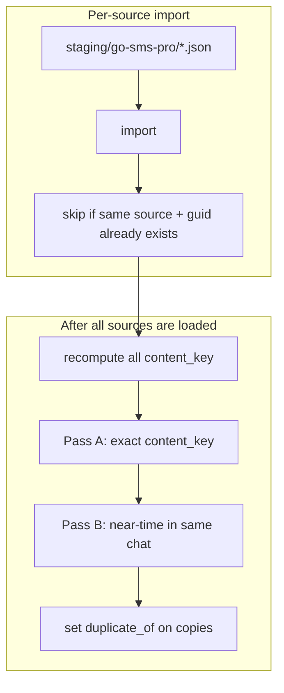
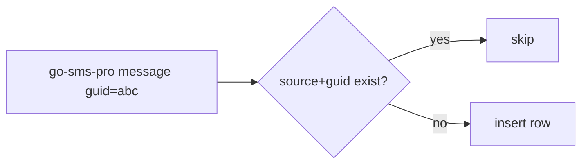
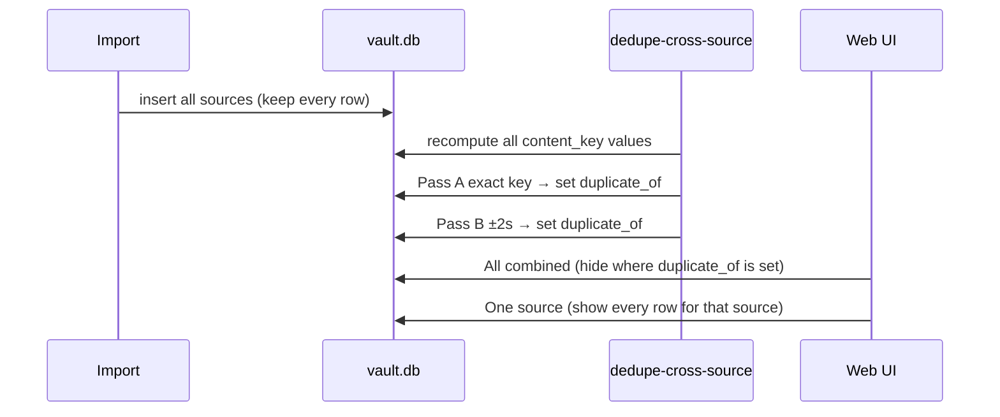
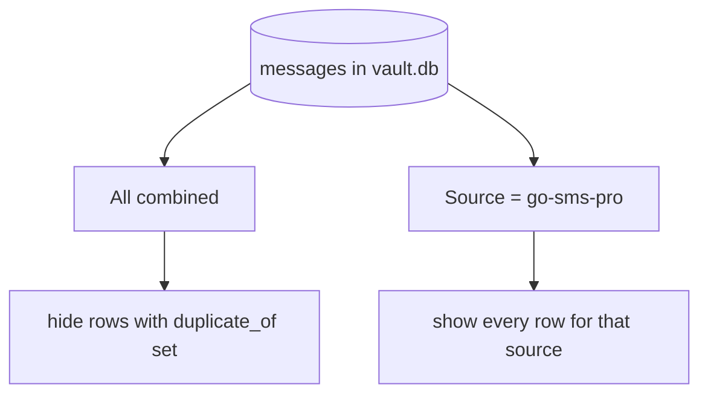

# How message dedupe works

**Short answer:** Each archive is deduped against itself on import. After import, a separate database pass soft-hides the same SMS when it shows up in more than one archive. Rows are never deleted.

## Terms

- **Source** — one configured archive, such as `go-sms-pro` or `sms-backup-plus`.
- **Guid** — a message id string written by the exporter. Guids are only unique *inside* one source.
- **Content key** — a hash built from chat + UTC time + direction + text + attachment hashes. Used to find the same SMS across sources.
- **Soft-hide** — set `duplicate_of` to point at the kept message. The copy stays in the database but the combined view skips it.

## Why two kinds of dedupe

Android and EML backups often contain the same texts. Example: Mom’s “Running late” appears in both `go-sms-pro` and an sms-backup-plus EML dump. Guids do not match across exporters, so a second pass on the database is required.



## 1. Per-source dedupe (import)

Happens during `import` / `import-staging.sh`.

| Mode | Behavior |
|------|----------|
| **replace** | Delete that source’s messages, then load staging again. |
| **append** | Keep existing rows. Skip a row when the same `source` + `guid` is already present. |

Other sources are not touched.



## 2. Cross-source dedupe (database pass)

Runs after import:

```bash
cargo run --release -- dedupe-cross-source
# also run automatically by ./message-exporter/import-staging.sh
```

### Content key

Each message gets a `content_key`:

```
hash(
  chat_identifier
  + direction (from me / not)
  + UTC epoch seconds
  + normalized body text
  + sorted attachment sha256 hashes
)
```

UTC epoch seconds come from `timestamp_utc` when present, otherwise from `timestamp` with its offset applied. `2015-03-12T18:04:22Z` and `2015-03-12T14:04:22-04:00` hash the same.

Example: both archives store Mom at `+14075551212`, that UTC second, body `Running late` → same content key even when guids differ.

Re-running `dedupe-cross-source` rebuilds **every** content key and clears prior `duplicate_of` flags before matching again.

### Pass A — exact match

Group messages that share a content key and come from **two or more** sources. Keep one survivor. Soft-hide the rest.

Survivor rules (in order):

1. Prefer the row with more hashed attachments.
2. Else prefer earlier order in `config.toml` `[[sources]]`.
3. Else prefer the lower message id.

### Pass B — near time

Exact seconds sometimes disagree (EML archives lose sub-second detail, small clock skew). Inside **one conversation**, look for pairs that:

- come from different sources
- have the same direction
- have the same non-empty body **or** the same attachment hashes
- fall within **±2 seconds** (configurable with `--window-secs`)
- are not already soft-hidden



## What the UI shows



- **All (combined)** — one copy of each matched SMS.
- **Single source** — the full archive, including soft-hidden copies. Useful for checking what one dump actually contained.

## What matches well / what can miss

**Usually matches**

- Same 1:1 SMS in two Android/EML sources with matching UTC second and body.
- Same MMS bytes (attachment `sha256` already stored at import).

**May miss**

- Bodies that differ only by encoding (HTML entities, emoji forms).
- Group chats where participant sets produced different chat ids.
- Time skew larger than the window (default 2 seconds).

**False positives (rare)**

- Two different texts with the same body in the same chat within 2 seconds, same direction. Soft-hide is reversible: clear `duplicate_of` or re-run dedupe after fixing data.

## What is not done

- Losing rows are **not** deleted — only flagged.
- Cross-source matching does **not** use `guid` — exporter guids disagree too often.
- There is no fuzzy full-text search across the whole database (too slow and noisy).

## Commands

```bash
# Import + cross-source dedupe
./message-exporter/import-staging.sh

# Dedupe alone (on an existing DB)
cargo run --release -- dedupe-cross-source
cargo run --release -- dedupe-cross-source --window-secs 2
```

Re-running dedupe rebuilds content keys and `duplicate_of` flags from scratch.
