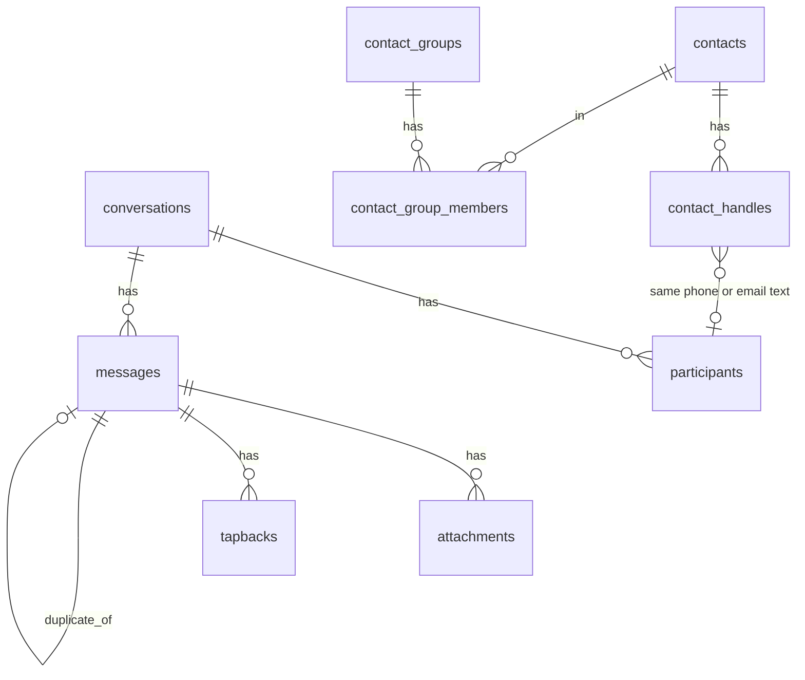
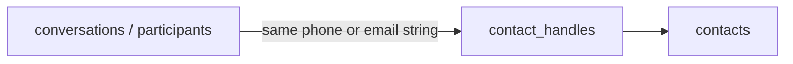

# Vault database tables

This file describes every lasting table in the Message Vault SQLite database, and how the tables point at each other.

The tables fall into four groups:

1. **Chats and texts** — threads, people in those threads, messages, files, reactions
2. **People and groups** — your address book inside the vault
3. **Staging** — temporary copies used while importing, then copied into the real tables
4. **Trash markers** — small lists that mark something as trashed without deleting the chat data

Chats and people are **not** joined by a shared person ID. They meet when the **same phone number or email text** appears in both places.

---

## Chats and texts

### `conversations`

One row = one chat thread.

| Column | Plain meaning |
|--------|----------------|
| `id` | Internal number for this chat |
| `chat_identifier` | How the chat is named in the backup (often a phone number for a 1:1 chat, or a group id) |
| `service` | Optional service label from the export |
| `conversation_type` | Kind of chat, such as individual or group |
| `group_title` | Optional group name |
| `exported_at` | Optional time the export was made |
| `source_file` | Which export file this chat came from |

Other tables point here with `conversation_id`.

### `participants`

One row = one phone number or email that belongs in one chat.

| Column | Plain meaning |
|--------|----------------|
| `id` | Internal number for this row |
| `conversation_id` | Which chat this person is in (points to `conversations.id`) |
| `handle` | Their phone number or email |
| `name_hint` | Optional display name that came with the backup (not the same as a vault contact) |

The same handle can appear in more than one chat. Each chat gets its own participant row. Inside one chat, each handle appears only once (`UNIQUE` on conversation + handle).

### `messages`

One row = one text (or similar message) inside a chat.

| Column | Plain meaning |
|--------|----------------|
| `id` | Internal number for this message |
| `conversation_id` | Which chat it belongs to (points to `conversations.id`) |
| `source` | Which archive it came from (for example `sms-backup-plus`) |
| `guid` | Optional id string from that archive |
| `timestamp` / `timestamp_utc` | When it was sent |
| `is_from_me` | Whether you sent it |
| `sender` | Who sent it (phone/email text when known) |
| `subject` / `body` | Subject and text body |
| `content_key` | Hash used when comparing the same SMS across archives |
| `duplicate_of` | If set, points to another `messages.id` that this row is a copy of |

Other message fields store reply and announcement details used by some exporters.

### `attachments`

One row = one file tied to one message (photo, video, and so on).

| Column | Plain meaning |
|--------|----------------|
| `id` | Internal number |
| `message_id` | Which message owns this file (points to `messages.id`) |
| `path` / `assets_path` | Where the file lives on disk |
| `original_name` | Original filename when known |
| `mime_type` | File type |
| `sha256` | Fingerprint of the file bytes |
| `derived_*` | Optional converted copy (for example a resized image) |

### `tapbacks`

One row = one reaction on a message (heart, thumbs up, and so on).

| Column | Plain meaning |
|--------|----------------|
| `id` | Internal number |
| `message_id` | Which message was reacted to (points to `messages.id`) |
| `kind` / `emoji` | What kind of reaction |
| `is_from_me` / `sender` | Who reacted |

---

## People and groups

### `contacts`

One row = one person in the vault address book.

| Column | Plain meaning |
|--------|----------------|
| `id` | Internal number for this person |
| `first_name` / `last_name` | Their name |
| `exclude` | Flag used to mark someone as excluded in the UI |
| `preferred_handle` | Optional main phone or email to show |

### `contact_handles`

One row = one phone number or email that belongs to one contact.

| Column | Plain meaning |
|--------|----------------|
| `handle` | The phone or email (this is the primary key) |
| `contact_id` | Which contact owns it (points to `contacts.id`) |

One contact can have many handles. Each handle points to only one contact.

### `contact_groups`

One row = one named group label (for example Family).

| Column | Plain meaning |
|--------|----------------|
| `id` | Internal number |
| `name` | Group name (unique) |

### `contact_group_members`

One row = “this contact is in this group.”

| Column | Plain meaning |
|--------|----------------|
| `contact_id` | Points to `contacts.id` |
| `group_id` | Points to `contact_groups.id` |

Together those two columns are the primary key, so a contact appears at most once in a given group.

---

## How chats meet people

There is no column like `contact_id` on `conversations` or `participants`.

The link is the **handle text**:

- A 1:1 chat’s `conversations.chat_identifier` is often a phone or email.
- `participants.handle` is also a phone or email.
- `contact_handles.handle` is the address-book side of the same string.

If the strings match, the UI can treat that chat as belonging to that contact. If there is no matching `contact_handles` row, the chat can show up as unassigned.

`participants.name_hint` is only a label from the backup. It does not create a row in `contacts`.

---

## Staging tables

During import, data is first written into mirror tables, then moved into the real tables above.

| Staging table | Matches |
|---------------|---------|
| `staging_conversations` | `conversations` |
| `staging_participants` | `participants` |
| `staging_messages` | `messages` (without cross-source duplicate fields) |
| `staging_attachments` | `attachments` |
| `staging_tapbacks` | `tapbacks` |

Relationships inside staging are the same shape: conversations → participants and messages → attachments and tapbacks. After a successful promote, the lasting data lives in the non-staging tables.

---

## Trash markers

These tables do not store the chat or contact themselves. They mark an id or handle as trashed. The underlying conversation or contact rows can still exist.

### `trashed_handles`

| Column | Plain meaning |
|--------|----------------|
| `handle` | Phone or email marked trashed |
| `trashed_at` | When it was marked |

### `trashed_conversations`

| Column | Plain meaning |
|--------|----------------|
| `conversation_id` | Chat id marked trashed |
| `trashed_at` | When it was marked |

### `trashed_contacts`

| Column | Plain meaning |
|--------|----------------|
| `contact_id` | Contact id marked trashed |
| `trashed_at` | When it was marked |

---

## Quick map

| You want… | Look in… |
|-----------|----------|
| A chat thread | `conversations` |
| Who is listed in a chat | `participants` |
| The texts | `messages` |
| Photos and files | `attachments` |
| Reactions | `tapbacks` |
| A person you named | `contacts` |
| Their phone numbers / emails | `contact_handles` |
| Group labels | `contact_groups` + `contact_group_members` |
| Soft-deleted items | `trashed_*` |
| Import scratch space | `staging_*` |

Table definitions in code: [`src/schema.rs`](../src/schema.rs).

Related: [how message dedupe works](dedupe.md).
